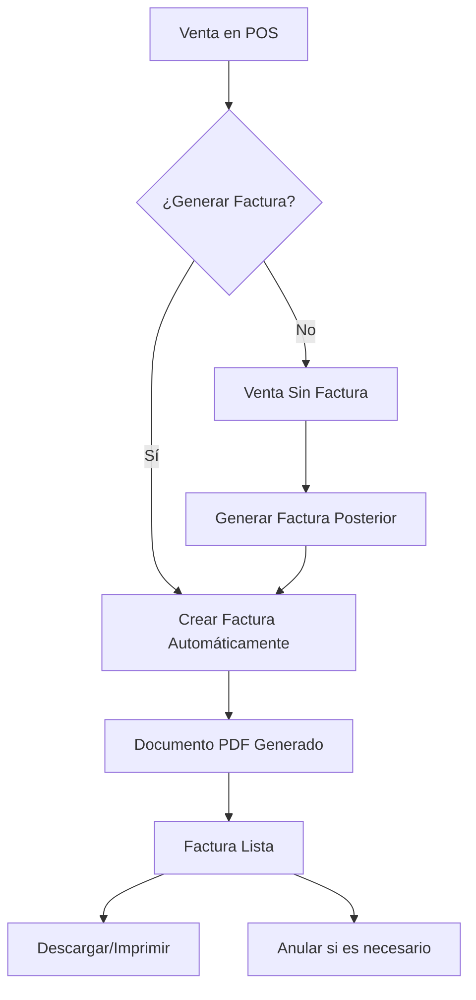

# Sistema de Facturación Integrado - La Cantina de Cantina

## 🧾 Nueva Funcionalidad: Facturación Completa

Se ha implementado un sistema completo de facturación integrado con el POS (Punto de Venta) existente, que permite generar documentos fiscales profesionales con cumplimiento legal.

---

## ✨ Características Principales

### 🏪 Integración con POS
- **Facturación al momento de la venta**: Opción de generar factura directamente desde el checkout
- **Generación retroactiva**: Posibilidad de generar facturas de ventas ya realizadas
- **Vista previa y descarga PDF**: Documentos profesionales listos para imprimir

### 📋 Gestión de Documentos Fiscales
- **Múltiples tipos**: Boletas, Facturas Exentas y Facturas Afectas
- **Numeración automática**: Sistema secuencial único por tipo de documento
- **Estados del documento**: Borrador, Emitida, Anulada, Vencida
- **Historial completo**: Registro de todas las acciones realizadas

### 🎨 Interface de Usuario Mejorada
- **Modal de facturación en POS**: Checkbox para generar factura con campos dinámicos
- **Lista de facturas**: Vista consolidada con filtros y búsqueda
- **Detalle de factura**: Vista completa con opción de PDF
- **Integración visual**: Diseño consistente con Tailwind CSS

---

## 🔧 Implementación Técnica

### Arquitectura del Sistema
```
ventas/              # App principal de ventas (existente)
├── models.py        # Modelo Factura mejorado
├── views.py         # Vistas integradas con facturación
└── templates/       # Templates de POS y ventas

facturacion/         # Nueva app de facturación
├── models.py        # Configuración y historial
├── views.py         # CRUD completo de facturas
└── templates/       # Interface de gestión fiscal

templates/
├── facturacion/     # Templates específicos de facturación
│   ├── lista_facturas.html
│   ├── detalle_factura.html
│   └── configuracion.html
└── ventas/          # Templates mejorados de ventas
    ├── pos_dashboard.html    # POS con opción de factura
    ├── lista_ventas.html     # Lista con estado de facturación
    └── detalle_venta.html    # Detalle con acciones de factura
```

### Modelo de Datos Unificado
- **Relación 1:1**: Cada venta puede tener una factura
- **UUID como PK**: Identificadores únicos para facturas
- **Campos fiscales**: RUT, dirección, teléfono, email del cliente
- **Cálculos automáticos**: IVA y totales calculados dinámicamente
- **Auditoria completa**: Usuario creador, fechas de emisión/anulación

---

## 📱 Uso del Sistema

### 1. Facturación desde POS
1. Realizar venta normal en el POS
2. En modal de pago, marcar "Generar Factura"
3. Completar nombre del cliente (opcional)
4. Confirmar venta
5. Se genera automáticamente la factura

### 2. Facturación Retroactiva
1. Ir a "Ventas" > "Lista de Ventas"
2. Buscar la venta sin factura
3. Hacer clic en el ícono de generar factura
4. Completar datos del cliente
5. Confirmar generación

### 3. Gestión de Facturas
1. Acceder a "Facturación" > "Lista de Facturas"
2. Ver todas las facturas con filtros
3. Entrar al detalle para ver información completa
4. Descargar PDF o anular según sea necesario

### 4. Configuración del Sistema
1. Ir a "Facturación" > "Configuración"
2. Configurar datos de la empresa
3. Ajustar numeración de documentos
4. Establecer porcentajes de IVA

---

## 🔄 Workflow de Facturación



---

## 🛠️ Archivos Modificados/Creados

### Archivos Nuevos
- `facturacion/` - Nueva aplicación completa
- `templates/facturacion/` - Templates de gestión fiscal
- `templates/ventas/lista_ventas.html` - Lista de ventas mejorada
- `templates/ventas/detalle_venta.html` - Detalle de venta con facturación

### Archivos Modificados
- `ventas/models.py` - Modelo Factura mejorado con campos fiscales
- `ventas/views.py` - Integración con sistema de facturación
- `templates/ventas/pos_dashboard.html` - POS con opción de factura
- `cantina_tita/settings.py` - Registro de nueva app
- `cantina_tita/urls.py` - URLs de facturación

### Migraciones
- `ventas/migrations/0003_*` - Migración del modelo Factura mejorado
- `facturacion/migrations/0001_*` - Migración inicial de facturación

---

## 📋 Funcionalidades Completadas

✅ **Modelo de datos completo** - Relaciones, validaciones y campos fiscales
✅ **Integración POS** - Opción de facturar al momento de venta
✅ **Generación retroactiva** - Facturar ventas ya realizadas
✅ **Interface de gestión** - CRUD completo de facturas
✅ **Generación PDF** - Documentos fiscales con ReportLab
✅ **Numeración automática** - Sistema secuencial por tipo
✅ **Historial de cambios** - Auditoria completa de acciones
✅ **Estados de documento** - Workflow completo de facturación
✅ **Templates responsivos** - Interface moderna con Tailwind CSS
✅ **Validaciones** - Controles de negocio y datos requeridos

---

## 🚀 Próximas Mejoras Sugeridas

- **Integración con servicios fiscales** - Conexión con SII para documentos oficiales
- **Facturación electrónica** - XML y firma digital
- **Reportes avanzados** - Análisis de facturación por período
- **Email automático** - Envío de facturas por correo
- **Códigos de barras** - Integración con lectores de códigos
- **Múltiples empresas** - Soporte para diferentes puntos de venta

---

## 🔍 Testing y Validación

El sistema ha sido desarrollado siguiendo las mejores prácticas:

- **Transacciones atómicas** - Integridad de datos garantizada
- **Validaciones de negocio** - Controles en modelo y vista
- **Manejo de errores** - Respuestas apropiadas ante fallos
- **Compatibilidad** - Funcionamiento con datos existentes
- **Performance** - Consultas optimizadas y paginación

---

*Sistema desarrollado para La Cantina de Cantina - Octubre 2025*